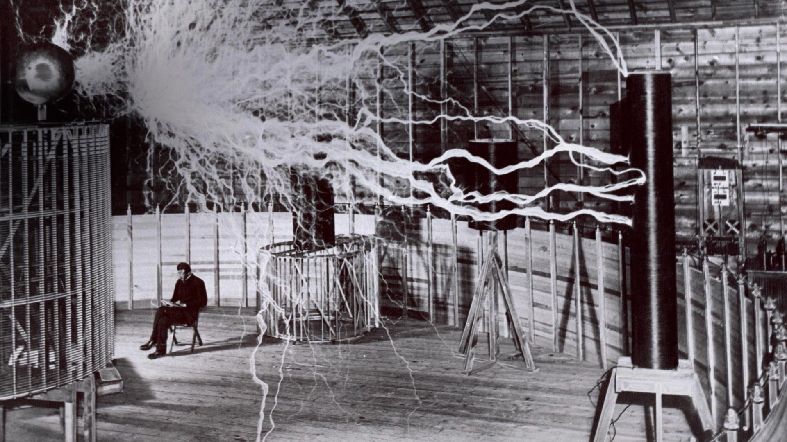

# R.G. Markdown Learning   
# (看文档源码快速学习Markdown语法)

## Markdown标题的两种格式：

## 1.使用 = 和 - 标记一级、二级标题
用 = 来标记一级标题（这是一级标题）
===
用 - 来标记二级标题（这是二级标题）
---
多个=或-等价于一个


## 2.使用 # 号可表示 1-6 级标题，一级标题对应一个 # 号，二级标题对应两个 # 号，以此类推。

# 一级标题
## 二级标题
### 三级标题
#### 四级标题
##### 五级标题
###### 六级标题

## Markdown段落：
Markdown 段落没有特殊的格式，直接编写文字就好，段落的换行是使用两个以上空格加上回车。下面开始段落换行:  
使用两个空格+回车进行了换行。（注意：普通的回车在Markdown显示时不能起到换行的作用）

测试在段落后面使用一个空行来表示重新开始一个段落。

## Markdown字体

普通文本  
*斜体文本1*  
_斜体文本2_  
**粗体文本1**  
__粗体文本2__  
***粗斜体文本1***  
___粗斜体文本2___  

## Markdown分隔线

可以在一行中用三个以上的星号、减号、底线来建立一个分隔线，行内不能有其他东西。也可以在星号或是减号中间插入空格。下面每种写法都可以建立分隔线：

三个（超过3个即可，下面用3+表示“超过3个即可”）*的分隔线：
***

三个*（3+，用空格分隔*）的分隔线：
* * *

三个-（3+，必须用空格分隔，不然就是二级标题了）的分隔线：
- - -

三个下划线_（3+，可以用空格分隔，也可不）的分隔线：
_ _ _

## Markdown删除线

文字要添加删除线，只需要在文字的两端加上两个波浪线 ~~ 即可：

~~这是要被删除的话~~

## Markdown下划线

下划线可以通过 HTML 的 < u >（这里的空格是为了表示这个标签，真正使用时不含空格） 标签来实现：

<u>这是要被加下划线的话</u>

## Markdown脚注

这是一个脚注: [^我是脚注]。

[^我是脚注]：Markdown脚注，见本文档源代码
（不知道为啥，VScode显示不了，可能不支持）

## Markdown列表

Markdown 支持有序列表和无序列表。

无序列表使用星号(*)、加号(+)或是减号(-)作为列表标记：

### 无序列表1

* 第一项
* 第二项
* 第三项

### 无序列表2

+ 第一项
+ 第二项
+ 第三项

### 无序列表3

- 第一项
- 第二项
- 第三项

有序列表使用数字并加上 . 号来表示：

### 有序列表

1. 第一项
2. 第二项
3. 第三项

列表嵌套只需在子列表中的选项添加四个空格即可：

### 嵌套列表

1. 第一项
    * 项一元素一
    + 项一元素二
    - 项一元素三
2. 第二项
    + 项二元素一
    + 项二元素二

## Markdown区块

Markdown 区块引用是在段落开头使用 > 符号 ，然后后面紧跟一个空格符号：

> 这是一个区块引用，我是区块1

> 我是区块2

> 我是区块3

区块是可以嵌套的，一个 > 符号是最外层，两个 > 符号是第一层嵌套，以此类推退：

> 嵌套区块最外层
>> 嵌套区块第一层
>>> 嵌套区块第二层

在区块中也可以使用列表：

> 区块中使用列表
> 1. 第一项
> 2. 第二项
> + 第一项
> * 第二项
> - 第三项

当然也可以在列表中使用区块：  
在列表项目内放进区块，那么就需要在 > 前添加四个空格的缩进。

区块中使用列表实例如下：

+ 列表第一项
    > 区块1

    > 区块2
* 列表第二项
    > 区块1
    > 区块2

## Markdown代码

段落上的一个函数或片段的代码可以用反引号把它包起来（`）：

`printf()函数`

### 代码区块

代码区块使用 4 个空格或者一个制表符（Tab 键）。

    #include<studio.h>
    
    int main()
    {
        printf("%s","这是用四个空格/一个tab控制的代码区块")
    }

也可以用 ``` 包裹一段代码，并指定一种语言（也可以不指定）：

```python
import re
print('这是用```控制的代码区块')
```

注意到，用```控制的代码区块会有高亮显示，而四个空格/一个tab控制的代码区块不会有高亮显示

## Markdown链接

链接的两种格式：

带名称的链接：
[链接名称](链接地址)

或者

直接外显链接地址URL：
<链接地址>

举例如下：

[菜鸟教程](http://www.runoob.com/)

<http://www.runoob.com/>

### 高级链接

链接也可以用变量来代替，文档末尾附带变脸地址(有点类似Latex的参考文献):

这个链接用 1 作为网址变量[菜鸟教程][1]

这个链接用 菜鸟教程 作为网址变量 [菜鸟教程][菜鸟教程]

[1]: http://www.runoob.com/

[菜鸟教程]: http://www.runoob.com/

## Markdown图片

Markdown 图片语法格式如下：

开头一个感叹号 !

接着一个方括号，里面放上图片的替代文字

接着一个普通括号，里面放上图片的网址，最后还可以用引号包住并加上选择性的 'title' 属性的文字。




也可以像网址链接那样对图片网址使用变量：

这个链接用 2 作为网址变量 [RUNOOB][2].
然后在文档的结尾位变量赋值（网址）

[2]: http://static.runoob.com/images/runoob-logo.png

Markdown还没有办法指定图片的高度与宽度，如果需要的话，可以使用普通的 < img > 标签：

